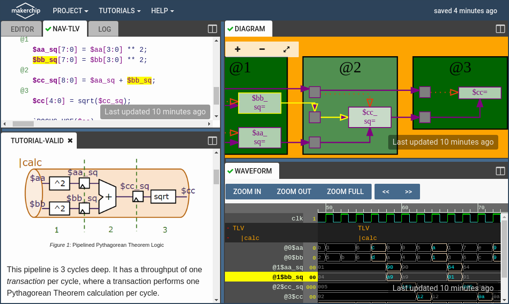

# Makerchip IDE

## Overview

Makerchip is a free, online IDE for open-source Verilog/TL-Verilog design.

## Features

Features include:

- Tutorials/courses/examples
- Waveform viewer
- Automatic diagrams
- Local and remote file editing
- Support for external editing/compilation
- Transaction-level abstractions
- "Visual Debugging" feature
- Virtual FPGA lab
- Tiny Tapeout support
- Documentation

## Try It!

For more information and to try for yourself, visit [Makerchip.com](https://makerchip.com).
